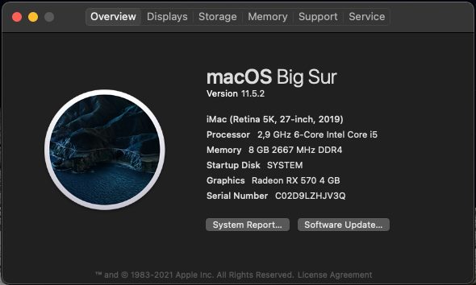
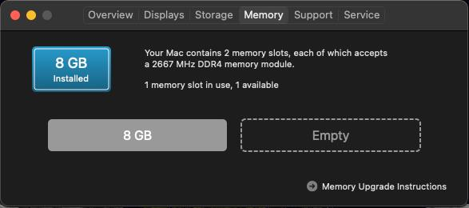

#Asrock H310 _ i5-9400f _ rx570 Hackintosh with OpenCore

-   macOS version: **Big Sur** **11.5.2**

## Overview

 
<strong>macOS Big Sur</strong>

 

 

## Hardware Specifications

|     Category      |                           Detail                            |
| :---------------: | :---------------------------------------------------------: |
|     Mainboard     |                         Asrock H310                         |
|        CPU        |                     Intel Core i5-9400F                     |
|       DGPU        |                   AMD RX 570 rog strix 4G                   |
|      Memory       |                        8GB DDR4-2666                        |
|      Drives       | Toshiba 1 TB 5400 rpm SATA & Samsung 970 Evo 250GB NVMe M.2 |
| Network interface |                         Intel I219                          |
|       Audio       |                       Realtek ALC887                        |

## Note

-   Generate your own MLB, SystemSerialNumber, SystemUUID (https://dortania.github.io/OpenCore-Install-Guide/config-laptop.plist/kaby-lake.html#platforminfo)
-   Use the Proper Tree and GenMSBIOS to edit the Generic in the Platforminfo section :D
